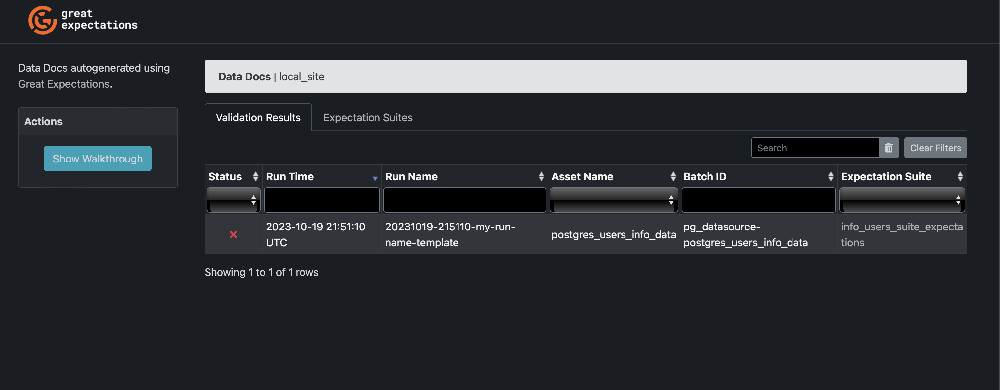
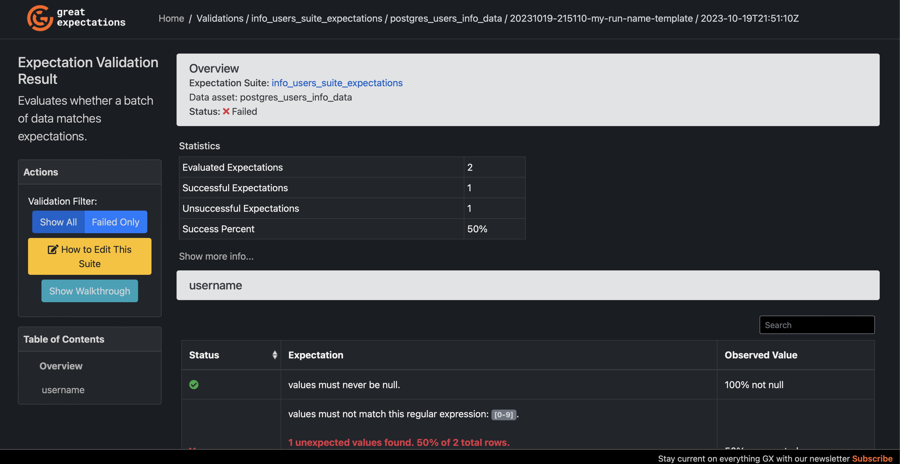

# Great Expectations and DBT Project

## Prerequisites
- Docker
- A web browser
- 5 minutes of your time

## Objective
The purpose of this project is to test the integration of Great Expectations with Python and the `great-expectations` library for DBT. This demonstrates the capability to execute tests on data before or after running our ETL (Extract, Transform, Load) processes.

While this is highly useful, it does require some initial setup and verification of feasibility.

## How to Test this Project

1. Clone the project and navigate to the project folder:
```bash
git clone https://github.com/fjpulidop/dbt_greatexpectations_tutorial.git
cd dbt_greatexpectations_tutorial
```

2. Run the following Docker Compose command:
```bash
docker-compose up --force-recreate --build -d
```
(wait 1 minute)

3. If you wish to see the logs of the Docker Compose and observe the results of the tests performed by DBT using Great Expectations, execute:
```bash
docker-compose logs
```

4. To view the Great Expectations web interface, where you can see tests written in Python:
- Navigate to the docs folder.
- Open the index.html file in a web browser.



I hope you find this helpful!